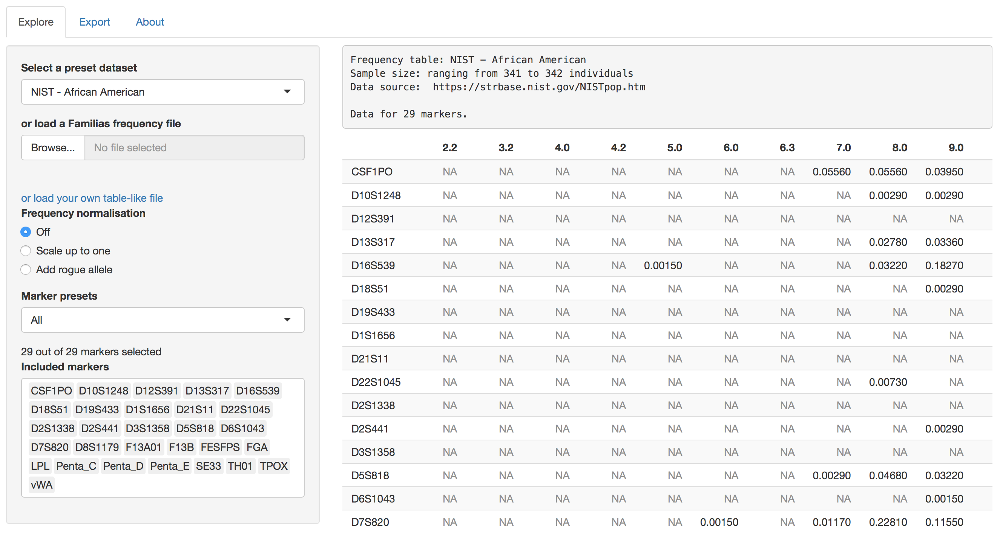

```{r setup, include=FALSE}
knitr::opts_chunk$set(echo = TRUE)
```

# fafreqs - Forensic allele frequency databases

The `fafreqs` R package is a compilation of widely available allele frequency databases for markers commonly used in forensic applications (mainly STRs). It provides compatibility functions that enable interoperability with other DNA-analysis related R packages such as those part of the pedsuite.

In addition, it includes a shiny UI that makes it easy to export datasets in various formats. The shiny UI also serves as a demonstration of the shiny module that the package exposes, that may be utilised as an input component in other shiny applications to facilitate frequency data import.

## Installation

`fafreqs` is only available on GitHub so the `devtools` package is required to install it. If you do not have it installed (or you are not sure if you have it) install it from CRAN with the following command:

```{r eval=FALSE}
install.packages("devtools")
```

Once you have `devtools`, the `fafreqs` package can be installed with
```{r eval=FALSE}
devtools::install_github("knifecake/fafreqs")
```


## Example usage

Once installed, datasets become available after loading the package

```{r eval=FALSE}
library("fafreqs")

# datasets become available as objects
ft_popstr_europe
```

### Exporting allele frequency tables

All datasets available through the `fafreqs` package may be exported to various formats. For now, exporting is possible to the standard table-like format and to the format used by [Familias](https://familias.no).

```{r eval=FALSE}
library(fafreqs)

# save the NIST African American dataset as a standard CSV file
write_csv(ft_nist_african_american, "nist_african_american.csv")

# save the NIST African American dataset as a Familias-compatible file
write_familias(ft_nist_african_american, "nist_african_american.txt")
```


### Usage with the pedsuite package family

`fafreqs` can be used to set so-called `locusAttributes` in `ped` objects handled by the pedsuite set of R packages (see [`pedtools`](https://github.com/magnusdv/pedtools) and [`forrel`](https://github.com/magnusdv/forrel) for more information).

Once a pedigree is loaded or created but before adding known genotypes, information about markers and allele frequencies can be loaded using the `pedtools::setMarkers()` function. This function takes a special list as its `locusAttributes` parameter that can be generated directly from a `freqt` object by calling `to_pedtools_locusAttributes`.

```{r}
library(pedtools)
library(fafreqs)

p = nuclearPed(1)
p = setMarkers(p, locusAttributes = to_pedtools_locusAttributes(ft_nist_african_american))

# allele frequencies for the markers described in ft_nist_african_american are
# attached to the pedigree
afreq(p, "CSF1PO")
```

If you prefer to obtain marker objects instead, you may use the function `to_pedtools_markers`. Keep in mind that it requires the pedigree to be defined beforehand.

## Included datasets

The following datasets are included with the `fafreqs` package

- **STRidER:** data from all available countries (Austria, Belgium, Bosnia and Herzegowina, Czech Republic, Denmark, Finland, France, Germany, Greece, Hungary, Ireland, Montenegro, Norway, Poland, Slovakia, Slovenia, Spain, Sweeden and Switzerland). More information can be found on the `data_strider` help page.

- **pop.STR:** data from some population (meta-)groups is available (Europe, NW Spain, Israel Carmel Druze, and all of Asia). More information can be found on the `data_popstr` help page.

- **NIST 1036:** data from all ethnic groups is available (All, African American, Asian, Caucasic and Hispanic). More information can be found on the `data_nist` help page.

To access the help page for a particular dataset use `?data_xxxx` from the R console. Alternatively, you may look up help for a particular population group and data source by typing `?ft_dataset_name` (e.g. `?ft_popstr_europe`).

## Using the shiny widget



The `fafreqs` package includes a shiny widget that can be incorporated into any other shiny application. A live demo of this widget can be found in the *Explore* tab of [this website](https://knifecake.shinyapps.io/fafreqs_shiny/). Keep in mind that the demo lives on a free account at shinyapps.io, so there is the chance that I have run out of compute hours and it is unavailable. In those cases, you may run the demo app locally yourself by typing `fafreqs_gui()` into an interactive R session after installing and loading the `fafreqs` package.

The `fafreqs` widget is not only useful when you want to provide predefined frequency tables, it can also be used as a standalone frequency database loader which accepts the most common formats (Familias, CSV, TSV...). In particular, different parts of the widget can be deactivated to provide a more tailored experience for your app, e.g. if you may not wish to allow loading from Familias and enforce that all file have the alleles as columns the widget can reflect that.

To use the widget in your own app refer to the documentation for the `fafreqs_widget_input`. A barebones implementation is show below:

```{r eval=FALSE}
library(shiny)
library(fafreqs)
library(gezellig)
library(markdown)

ui <- fluidPage(
        sidebarLayout(
          sidebarPanel = sidebarPanel(
            sidebarPanel = fafreqs_widget_input("demo_loader"),
            mainPanel = mainPanel(tableOutput("table"))
          )
        )
      )

server <- function(input, output, session) {

  # the output of the module is a reactive value containing the selected freqt
  # object
  freqt <- callModule(fafreqs_widget, "demo_loader")

  # example usage of the loaded table: displaying it back to the user
  output$table <- renderTable({
    as.data.frame(freqt())
  })
}

shinyApp(ui = ui, server = server)
```


## Issues, contributing and authors

Users are kindly asked to report errors to the authors. There are two ways of doing this:

- The preferred one is by filling out the form at https://github.com/knifecake/fafreqs/issues/new, although it requires a GitHub account.
- Users unable to use the first method can send an email to [eliashernandis@gmail.com](mailto:eliashernandis@gmail.com).

`fafreqs` is free software and it welcomes contributions, either in the form of datasets or improvements to the code.

`fafreqs` was developed by [Elias Hernandis](https://hernandis.me/).
